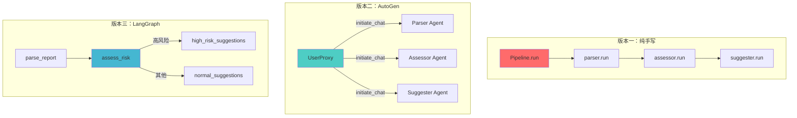

# 🏥 医疗报告分析多智能体系统

> 用三种方式（纯手写 / AutoGen / LangGraph）实现同一个医疗报告分析多智能体流水线，
> 深度对比不同框架的设计理念与工程实践差异。

## 📋 项目简介

这是一个**医疗体检报告智能分析系统**，包含三个协作 Agent：

```
用户上传体检报告
    ↓
Agent1：报告解析 Agent
├── 提取关键指标（血糖、血压、血脂、肝肾功能等）
├── 输出结构化 JSON
    ↓
Agent2：风险评估 Agent
├── 对比正常参考范围
├── 判定高/中/低风险等级
    ↓
Agent3：建议生成 Agent
├── 生成个性化健康建议
├── 紧急就医指导 + 饮食运动方案
    ↓
返回完整分析报告
```

## 🎯 为什么做三个版本？

| 学习目标 | 具体收获 |
|---------|---------|
| **版本一：纯手写** | 理解多智能体本质——状态传递、错误处理、流程控制 |
| **版本二：AutoGen** | 感受框架帮你做了什么——消息管理、Agent 对话协作 |
| **版本三：LangGraph** | 感受图编排的优势——声明式工作流、条件分支、可视化 |

**面试一句话总结：**

> "手写需要自己管状态传递和错误处理，AutoGen 简化了 Agent 对话协作，LangGraph 用图结构让工作流更清晰可控。"

## 🏗️ 项目结构

```
medical-multi-agent/
├── README.md                    # 本文件
├── requirements.txt             # 依赖管理
├── .env.example                 # API Key 配置模板
├── sample_reports/              # 示例体检报告
│   └── sample_report_1.txt
│
├── v1_handwritten/              # 版本一：纯 Python 手写
│   ├── main.py                  # 入口
│   ├── llm_client.py            # LLM 调用封装
│   ├── pipeline.py              # 手动串联 Pipeline
│   └── agents/
│       ├── base.py              # Agent 基类
│       ├── report_parser.py     # 报告解析 Agent
│       ├── risk_assessor.py     # 风险评估 Agent
│       └── suggestion.py        # 建议生成 Agent
│
├── v2_autogen/                  # 版本二：AutoGen 重写
│   ├── main.py                  # 入口
│   └── agents.py                # ConversableAgent 定义
│
└── v3_langgraph/                # 版本三：LangGraph 重写
    ├── main.py                  # 入口
    ├── state.py                 # 共享 State（TypedDict）
    ├── nodes.py                 # 图节点定义
    └── graph.py                 # 图编排 + 条件分支
```

## 🚀 快速开始

### 1. 环境准备

```bash
# 克隆项目
git clone https://github.com/your-username/medical-multi-agent.git
cd medical-multi-agent

# 安装依赖
pip install -r requirements.txt

# 配置 API Key
cp .env.example .env
# 编辑 .env，填入你的 API Key
```

### 2. 运行三个版本

```bash
# 版本一：纯手写
python -m v1_handwritten.main

# 版本二：AutoGen
python -m v2_autogen.main

# 版本三：LangGraph
python -m v3_langgraph.main
```

## ⚖️ 三版本对比

### 架构差异



### 详细对比表

| 对比维度 | 纯手写 | AutoGen | LangGraph |
|---------|--------|---------|-----------|
| **状态传递** | 手动变量传递 | 框架消息传递 | 共享 State 自动管理 |
| **错误处理** | 每步 try/except | 框架内置重试 | 节点级错误隔离 |
| **条件分支** | if/else 硬编码 | 手动控制对话流 | 声明式条件边 |
| **可扩展性** | 修改 Pipeline 代码 | 新增 Agent 加入对话 | 图中添加节点和边 |
| **可视化** | 无 | 对话日志 | 自动生成流程图 |
| **调试难度** | 打断点即可 | 需理解消息流 | 可逐节点检查状态 |
| **代码量** | ~200 行 | ~150 行 | ~250 行 |
| **学习曲线** | 低 | 中 | 中高 |
| **适用场景** | 简单线性流程 | Agent 对话协作 | 复杂工作流 + 条件分支 |

### 各版本核心代码对比

**版本一 — 手动传递状态：**
```python
# Pipeline 手动串联
parsed = self.parser.run(report_text)      # 手动传给下一个
risk = self.assessor.run(parsed)            # 手动传给下一个
suggestion = self.suggester.run(risk)       # 手动获取结果
```

**版本二 — AutoGen 消息驱动：**
```python
# AutoGen 通过 initiate_chat 自动管理消息
result1 = user_proxy.initiate_chat(parser, message=report)
result2 = user_proxy.initiate_chat(assessor, message=result1.chat_history[-1]["content"])
result3 = user_proxy.initiate_chat(suggester, message=result2.chat_history[-1]["content"])
```

**版本三 — LangGraph 图编排：**
```python
# LangGraph 声明式定义
graph.add_edge("parse_report", "assess_risk")
graph.add_conditional_edges("assess_risk", route_by_risk, {
    "high_risk": "generate_high_risk_suggestions",
    "normal": "generate_suggestions",
})
# 一行执行整个图
result = graph.invoke(initial_state)
```

## 🔬 LangGraph 条件分支（版本三亮点）

版本三实现了一个实际的条件分支场景：

```
风险评估结果
    ├── 高风险 → 走加强版建议路径（更详尽的就医指导）
    └── 中/低风险 → 走标准建议路径（常规健康建议）
```

这是 LangGraph 的核心优势——**声明式地定义条件分支**，而不是用 if/else 硬编码。

## 🔗 与家医助手项目的关系

本项目的医疗报告分析场景直接来源于家医助手（Family Doctor Assistant）项目的实际需求：

- **报告解析**：家医助手需要读取居民上传的体检报告
- **风险评估**：根据指标判断健康风险，辅助家庭医生做慢病管理
- **建议生成**：为居民提供个性化的健康指导

通过本项目的三版本对比实践，为家医助手的多智能体架构选型提供了技术决策依据。

## 📝 技术栈

- **Python** 3.10+
- **OpenAI SDK** — 通义千问/豆包 API（OpenAI 兼容接口）
- **AutoGen** — 微软多智能体框架
- **LangGraph** — LangChain 图编排框架
- **python-dotenv** — 环境变量管理

## 📄 License

MIT